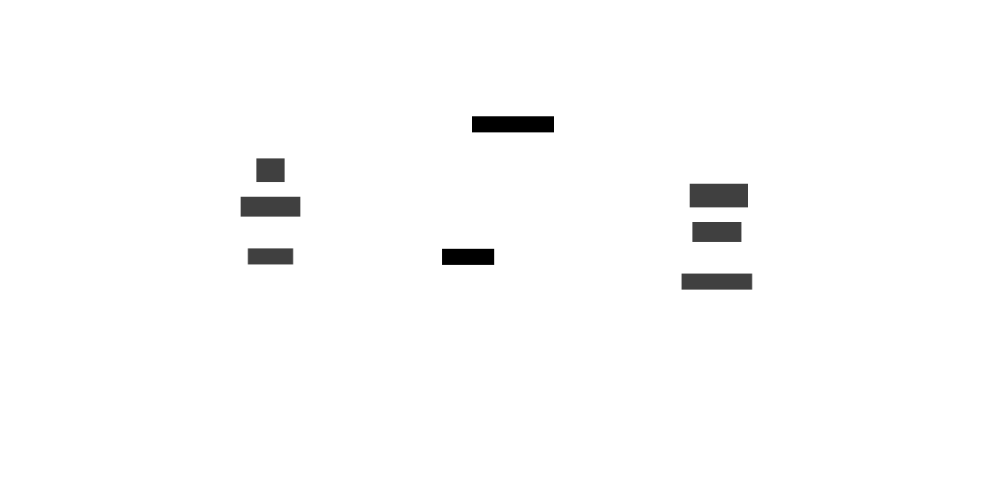

# fetcharr
[](https://goreportcard.com/report/github.com/soerenschneider/fetcharr)


Fetcharr is a [daemon](https://en.wikipedia.org/wiki/Daemon_(computing)) running on your local fileserver to fetch data from a remote [seedbox](https://en.wikipedia.org/wiki/Seedbox).

## Features

🪆 A powerful wrapper around rsync (or any other command) to fetch data from remote systems<br/>
🔌 Multiple pluggable event notifiers that invoke sync process (Kafka, RabbitMQ, webhooks, time-based)<br/>
🪝 Support for defining multiple pre- and post-hooks<br/>
🔭 Observability through Prometheus metrics<br/>

## Why would I need this?

🔨 You want to fetch data from a seedbox as soon as data has been downloaded successfully<br/>
📊 You want to get alerted on errors and look at dashboards rather than logs<br/>

## Deployment Overview


## Installation

### Requirements

- You need to have a seedbox / remote system that you can access via SSH. Authentication via ssh keys is required.
- The remote system needs to have rsync installed
- (If you want to use the example webhook script below, you also need to have curl installed. This should be the default on almost all distros.)


### Docker / Podman
````shell
$ git clone https://github.com/soerenschneider/fetcharr
$ cd fetcharr
$ docker run -v $(pwd)/contrib:/config ghcr.io/soerenschneider/fetcharr -config /config/fetcharr.yaml
````

### Binaries
Head over to the [prebuilt binaries](https://github.com/soerenschneider/fetcharr/releases) and download the correct binary for your system.
Use the example [systemd service file](contrib/fetcharr.service) to run it at boot.

### From Source
As a prerequesite, you need to have [Golang SDK](https://go.dev/dl/) installed. After that, you can install fetcharr from source by invoking:
```text
$ go install github.com/soerenschneider/fetcharr@latest
```

## Configuration
Head over to the [configuration section](docs/configuration.md) to see more details.

## Observability
Head over to the [metrics](docs/metrics.md) to see more details.

## Adding a webhook to Transmission
A guide that explains how to make Transmission call fetcharr's webhook endpoint can be found [here](docs/guides/adding-transmission-webhook.md).

## Changelog
The changelog can be found [here](CHANGELOG.md)
